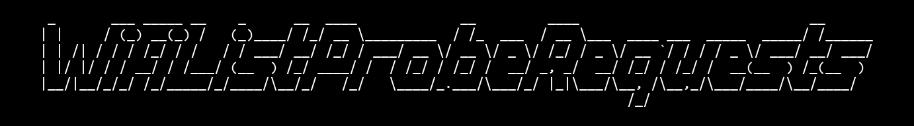
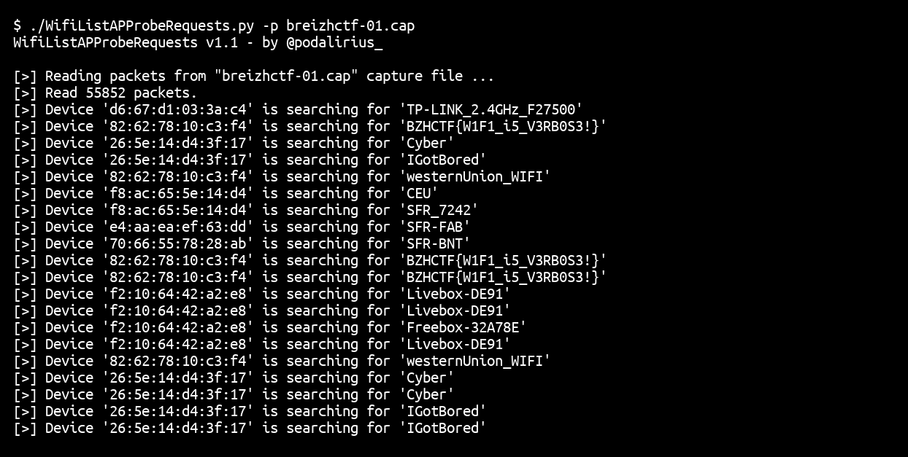

<p align="center">
    Monitor 802.11 probe requests from a capture file or network sniffing!
    <br>
    
    <a href="https://twitter.com/intent/follow?screen_name=podalirius_" title="Follow"></a>
    <a href="https://www.youtube.com/c/Podalirius_?sub_confirmation=1" title="Subscribe"></a>
    <br>
</p>

## Features

 - [x] Read input from a capture file with `--pcap`.
 - [x] Read packets from live wifi capture.
 - [x] Filter by device address with `--device [addr]`.
 - [x] Save results to logfile with `--logfile`.
 
## Usage

```
$ ./WifiListProbeRequests.py -h
WifiListProbeRequests v1.1 - by Remi GASCOU (Podalirius)

usage: WifiListProbeRequests.py [-h] [-v] [-d DEVICE] [-l LOGFILE] (-p PCAP | -i INTERFACE)

Monitor 802.11 probe requests from a capture file or network sniffing!

optional arguments:
  -h, --help            show this help message and exit
  -v, --verbose         Verbose mode
  -d DEVICE, --device DEVICE
                        Device address filter.
  -l LOGFILE, --logfile LOGFILE
                        Log output to file.
  -p PCAP, --pcap PCAP  Capture file to read packets from.
  -i INTERFACE, --interface INTERFACE
                        Interface to listen on.
```

## Demonstration



## Contributing

Pull requests are welcome. Feel free to open an issue if you want to add other features.
